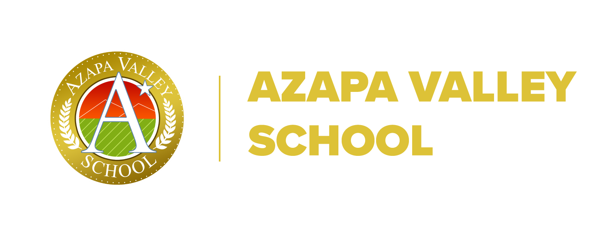

# Talleres: Azapa Valley School

<header>

</header>

Este espacio ha sido creado para inspirar a los estudiantes del [Colegio Azapa Valley School](https://azapavalley.cl/) a aprender Python y programación. Aquí encontrarás ejemplos prácticos y autocontenidos que te ayudarán a entender los principios básicos de programación en Python de manera sencilla y efectiva.

## 🎯 Objetivo del Taller

Motivar a los estudiantes en el aprendizaje de Python a través de ejercicios interactivos que desarrollan habilidades prácticas en funciones, manipulación de datos y resolución de problemas.

## 📚 Contenidos

- **Ejemplos de Python**: Códigos autocontenidos, desde básicos hasta avanzados.
- **Desafíos de Programación**: Ejercicios prácticos para fortalecer conceptos clave.
- **Actividades Interactivas**: Recursos dinámicos para un aprendizaje práctico.

## 📈 Resultados de Aprendizaje

Al finalizar, los estudiantes podrán:

1. **💻 Comprender conceptos básicos de programación**.
2. **🌐 Ejecutar y explorar código en un entorno interactivo**.
3. **🧩 Resolver problemas usando lógica condicional y matemáticas**.
4. **🔍 Experimentar y modificar código para observar resultados**.

